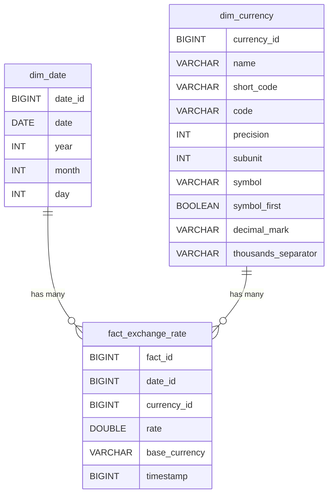

# Currency ETL with Historical and Incremental Loads

## Overview

This ETL pipeline is designed to process and store currency exchange rates data efficiently. It supports both initial historical loads and incremental daily updates:

- **First Run**: Loads all historical currency rates starting from `1996-01-01` to yesterday and stores them in a DuckDB data warehouse.
- **Subsequent Runs**: Fetches and loads new additions to dim_currecny and only rates since latest date from dim_date the `https://api.currencybeacon.com/v1/historic` endpoint.

### My approach:

From the outset, I aimed to create an application that was platform-independent and easy to deploy. To achieve this, I chose Docker as the deployment platform. Its containerization capabilities ensure the application can run consistently across various environments without dependency issues.

For data storage, I opted for DuckDB, a lightweight yet powerful database suitable for analytical workloads. Its simplicity in setup and integration with Python made it an ideal choice for this project.

To interact with DuckDB, I decided to use Python, leveraging its rich ecosystem and DuckDB client support. This allowed me to build the ETL logic efficiently while keeping the stack lightweight and modern.

The first step was understanding the API endpoints. Using Postman, I ran several queries to explore the data returned by the endpoints and the structure of the API responses. This exploratory step was crucial in designing the schema and ETL pipeline.

For the initial implementation, I asked ChatGPT to generate boilerplate code for the solution. This provided a strong starting point. From there, I iteratively added features and enhancements to the codebase, including:

Key generation and management to handle data integrity.
Incremental loading to avoid reprocessing already-loaded data and optimize API usage.
Error handling for robustness and logging.
One significant challenge was working with DuckDB, as I was not familiar with it beforehand. This led to issues with syntax and understanding its limitations, especially with constraints and transaction management. By thoroughly reviewing the DuckDB documentation and conducting experiments, I was able to resolve these issues and build a functional and efficient schema.

The result is an application that:

Is platform-agnostic, thanks to Docker.
Uses a lightweight database with a simple deployment footprint.
Supports incremental data loading and efficient handling of API calls.
Includes robust error handling and logging for easier debugging and maintenance.
This project not only achieved its technical goals but also provided a valuable learning experience in designing an end-to-end ETL solution with DuckDB and Python.


## Files and purpose
--main.py: Contains the ETL logic for fetching, transforming, and loading data.
--schema.sql: Defines the database schema for dim_currency, dim_date, and fact_exchange_rate.
--Dockerfile, docker-compose.yml: Used for containerizing and running the application.
--requirements.txt: Lists Python dependencies required for the ETL pipeline.
--etl_errors.log: Captures runtime errors for debugging purposes.

**Note**:  
This approach makes one API call per day since `1996-01-01`. For extensive data fetching, consider API rate limits or using bulk endpoints if available.

---

## Schema

The database schema consists of three key tables: `dim_currency`, `dim_date`, and `fact_exchange_rate`.

### Schema Code
```sql
CREATE TABLE IF NOT EXISTS dim_currency (
    currency_id BIGINT PRIMARY KEY,
    name VARCHAR,
    short_code VARCHAR UNIQUE,
    code VARCHAR,
    precision INT,
    subunit INT,
    symbol VARCHAR,
    symbol_first BOOLEAN,
    decimal_mark VARCHAR,
    thousands_separator VARCHAR
);

CREATE TABLE IF NOT EXISTS dim_date (
    date_id BIGINT PRIMARY KEY,
    date DATE UNIQUE,
    year INT,
    month INT,
    day INT
);

CREATE TABLE IF NOT EXISTS fact_exchange_rate (
    fact_id BIGINT PRIMARY KEY,
    date_id BIGINT NOT NULL,
    currency_id BIGINT NOT NULL,
    rate DOUBLE,
    base_currency VARCHAR,
    timestamp BIGINT,
    FOREIGN KEY (date_id) REFERENCES dim_date(date_id),
    FOREIGN KEY (currency_id) REFERENCES dim_currency(currency_id)
);
```

# Currency ETL Schema

## Entity-Relationship Diagram



## Setup Instructions

### Prerequisites
1. Install **Docker** and **Docker Compose** on your system.
2. Obtain a valid `CURRENCYBEACON_API_KEY` from [currencybeacon.com](https://currencybeacon.com).

### Steps
1. Clone the repository and navigate to the project root.
2. Fill the `.env` file with your API key.
3. Build and start the pipeline
```bash
docker compose up --build
```
4. Subsequent runs
```bash
docker run --env-file <path_to_project_root>/.env currencybeacon_etl_service-etl_service
```


## Querying Data
1. Install duckdb client (https://duckdb.org/docs/installation/?version=stable&environment=cli&platform=win&download_method=package_manager&architecture=x86_64)
2. Use any preferred IDE (i used VScode from sql fail to shell (see here: https://youtu.be/ZX5FdqzGT1E?si=6wYK2pZmN_Xfh8eV&t=59))
3. some example queries are given in queries.sql